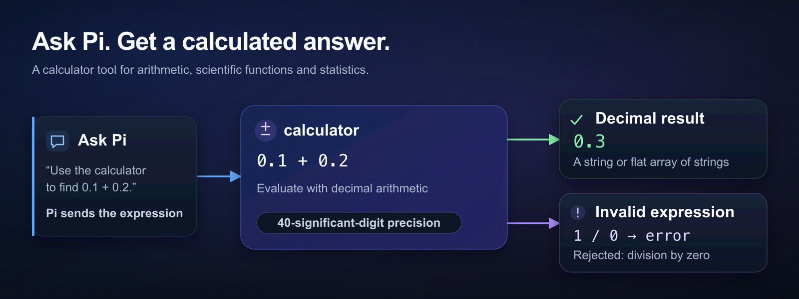

# pi-calculator

A calculator tool for [Pi](https://github.com/earendil-works/pi) that evaluates expressions with 40-significant-digit decimal precision. Ask Pi to check your math; it shows the expression and result in a tool card.



*Ask Pi for a calculation → the calculator evaluates it → Pi receives the result or an error.*

## Install and try it

You'll need Node.js 24+ and Pi 1.0.0+.

```sh
pi install npm:@fitchmultz/pi-calculator
pi
```

In the new Pi session, try:

```text
Use the calculator to evaluate [0.1 + 0.2, 2^64].
```

You'll see `["0.3","18446744073709551616"]` as the calculator's result. Pi calls the `calculator` tool with an `expression` string.

For Git installs or switching an existing install to npm, see [installation options](docs/reference.md#installation-options).

Pi extensions run with full system access. Review the source before installing.

## Expressions

Some expressions it understands:

```text
percent(15, 200)                 → 30
roundTo(-1.25, 1)                → -1.3
mean([2,4,6,8])                  → 5
sin(radians(90))                 → 1
sum([1e40,1,-1e40])              → 1
(12.5 * 1.0825) ^ 3              → 2477.500518798828125
```

Arithmetic supports `+`, `-`, `*`, `/`, `%`, `^` and `**`, with `PI` and `E` as constants. Put independent calculations in one flat array, as in the first example.

Trig uses radians. If your angle is in degrees, wrap it in `radians()` as shown above; `degrees()` converts back.

`roundTo(value, places)` rounds halves away from zero. Negative places round to tens, hundreds and so on.

The [expression reference](docs/reference.md#expressions) has the full function list, including statistics and array indexing.

## Results and limits

Results are decimal strings, or a flat array of decimal strings. Numbers and arithmetic are rounded to 40 significant digits using half-up rounding. Large finite results use scientific notation.

Invalid expressions, nonfinite results and nested result arrays produce errors. If any result in an array is invalid, the whole expression fails. Expressions have a 4,096-character limit, plus [nesting, output and work limits](docs/reference.md#limits).

For extensions that call the tool, the [result format](docs/reference.md#result-format) describes its structured output.

<a id="upgrading-from-v2"></a>

Upgrading from v2? The [migration notes](docs/reference.md#upgrading-from-v2) explain the renamed angle helpers and changed output format.

## Verification

To work on the calculator, start with the [development guide](docs/development.md): local checks, Pi compatibility testing and the release process. Release history is in the [changelog](CHANGELOG.md).

## License

[MIT](LICENSE) © Mitchell Fultz.
